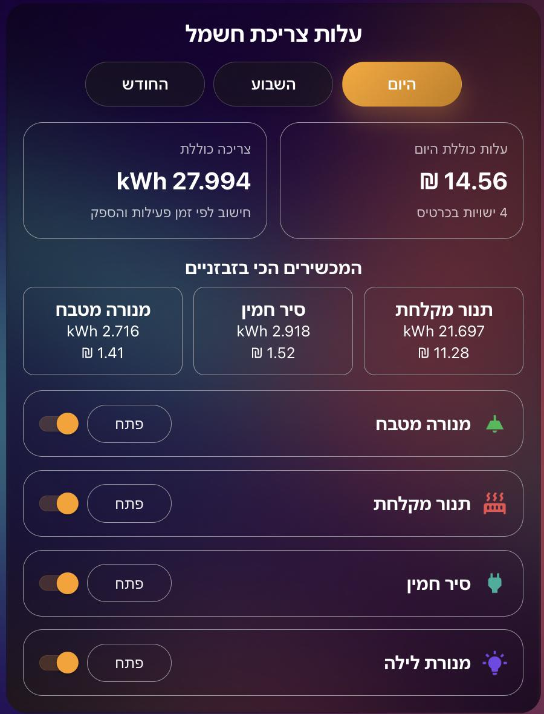

# power-cost-card
Power Cost Card is a custom Lovelace card for Home Assistant that calculates electricity consumption and cost for your devices based on power usage and active time.  The card provides a clean visual interface with real-time cost estimation, device control, and smart energy insights directly from your dashboard.

